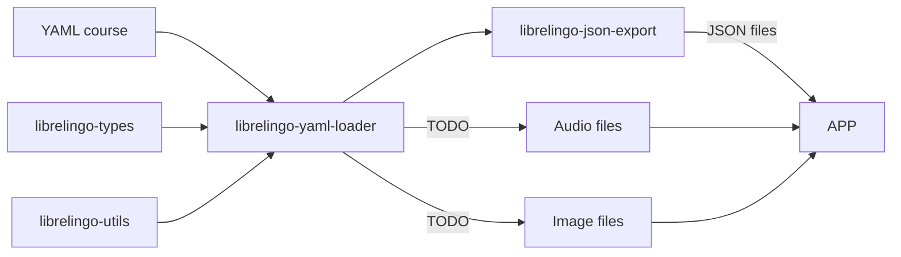

# Development

## Project structure

This project has 2 main components

- Frontend, implemented using Svelte and TypeScript.
- A set of Python packages that provide tooling for course creation and management.

The site is statically built and hosted on GitHub pages, therefore there's no real "backend" or API.

### Clickable flow chart



## Why does this project exist?

This project exists to create a beginner-friendly, community-oriented,
free software licensed language learning application. If you want to learn more
about LibreLingo's background, [I recommend reading this article](https://dev.to/kantord/why-i-built-librelingo-280o).

## Setting up the development environment

### Prerequisites

In order to install the dependencies of this project, you will need to have some basic
development tools installed.  

Otherwise, if you have Docker installed in your machine, you could simplify the process by just downloading the latest docker image or building your own thanks to the Dockerfile provided

#### Docker

From the root folder, just run
```bash
docker compose up -d
```

After the image has been downloaded / built, you should run the following command for letting the deps installs correctly:
```bash
docker compose exec -it app pdm install
```

This is due for the paths mounted in the docker-compose.yaml file

#### Ubuntu

If you are on Ubuntu, and you wish to install python environment and all the necessary deps on your machine, run this command in order to make sure you have all the basic dependencies:

```bash
apt-get install curl git python3-venv libpython3-dev wget unzip gcc libyaml-dev npm
```

On Ubuntu, it is also recommended to use Python 3.x as your default Python version:

```bash
apt-get install python-is-python3
```

### Web app

Source code can be found under /apps/web

#### Having the correct version of Node

You will need [Node](https://nodejs.org/en/).

In order to make sure you have the correct `node` version, it's recommended to use
`nvm`. To install `nvm`, please [consult nvm's official documentation](https://github.com/nvm-sh/nvm#installing-and-updating), but if you already have the correct version, you might not strictly need it.

First, install the correct `node` version with this command:

```bash
nvm install 20
```

Then, to choose this version of `node` in your terminal, use

```bash
nvm use 16
```

#### Install dependencies:

For this project it's recommended to use npm.  
Although, you could try to use yarn and open issue if there are some problems, so it could be tried to letting the two package managers cohesists. 

Yarn is a package manager for JavaScript that helps manage project dependencies, ensuring consistent and efficient installations. For more information about Yarn, [please refer to the official documentation](https://yarnpkg.com/). [The steps required to install yarn itself are documented here](https://classic.yarnpkg.com/lang/en/docs/install/#debian-stable).

Once you're in the root folder of the web app, just run

```sh
npm install
```
or 
```sh
yarn install
```

#### Starting the development server

Start the development server:

```sh
npm run dev
```

or

```sh
yarn run web dev
```

Now you should be able to see your app on <http://localhost:5173/>

### Python packages

If you want to test export new / updated courses, new features in the YAML format, or some changes in how they are being used
in the frontend, you need to be able to export YAML courses locally.
If you will use docker, everything will be included in the image, otherwise you could choose to install locally the tools needed.

#### Install `pdm`

You will need [PDM](https://pdm-project.org/latest/). If you don't have PDM, you can install it with

```bash
curl -sSL https://pdm-project.org/install-pdm.py | python3 -
```

For more information, check out [PDM's official documentation](https://pdm-project.org/latest/#installation).

#### Install dependencies using PDM

Run

```sh
pdm install
```
This command ensures your local dependencies match the project's **pyproject.toml** and **pdm.lock** files.

##### Handling Outdated Local Dependencies

When you update your local repository by pulling remote changes, your local dependencies might become outdated. To ensure your local dependencies are in sync with the project requirements, follow these brief steps:

###### Updating JavaScript Dependencies with Yarn

Update your local dependencies:

```bash
npm install
```

This command ensures your local dependencies match the project's **package.json** file. For more information, [refer to the Yarn documentation](https://yarnpkg.com/getting-started/usage).

### Locally test LibreLingo with real courses

In order to test LibreLingo with real courses just like in the deployed production version, you
need to install courses locally and export them from YAML to JSON.

#### Install courses

The following command installs all courses listed in the courses.json file just like
in production. _Keep in mind that in order to use them in the frontend, the courses
also need to be exported!_

```bash
yarn web run installAllExternalCourses
```

#### Export courses

In order to use a locally installed course when locally testing the frontend, you should
export the course first. You should also export the course every time you make local
changes to this course and you want the changes to be visible in the frontend.

Use the following command:

```bash
yarn exportAllCourses
```

You can export a single course using the following command (change the name of the course for the one that you need to export):

```bash
yarn run exportCourse spanish-from-english
```

###### Docker

```bash
docker compose exec -it app python3 /LibreLingo/app/librelingo_json_export/cli.py /LibreLingo/courses/<course_name> /LibreLingo/librelingo-web/src/courses/<course_name>
```

## Setting up Semaphore CI in a clone

In order for Semaphore CI to correctly operate, you will need to set up certain secrets.

This might not be necessary for you in all cases, but it cannot be avoided if you want to fully fork the repo, or work on CI configuration related tasks.

[Consult this page to read about setting up secrets in Semaphore CI.](https://docs.semaphoreci.com/essentials/using-secrets/)

Here's a list of the tokens you need to set up. Each of them is a link to a page explaining how to obtain the token:

- [GH_TOKEN](https://docs.github.com/en/github/authenticating-to-github/creating-a-personal-access-token)
- [KNAPSACK_PRO_TEST_SUITE_TOKEN_CYPRESS](https://www.npmjs.com/package/@knapsack-pro/cypress#configuration-steps)
- [PERCY_TOKEN](https://docs.percy.io/docs/environment-variables)

## Testing courses using GitHub gists

It's possible to test courses without them as HTML and deploying them.

One way of doing that is using GitHub gists. You can create a GitHub gist with the course JSON files.

The first step is to export the course as JSON. Then, you have to create a GitHub gist with the
course files.

Keep in mind, that you have to prefix all file names with `librelingo___` and therefore
The first step is to export the course as JSON. Then, you have to create a GitHub gist with the
course files.

Keep in mind, that you have to prefix all file names with `librelingo___` and replace
`/` with `___` in your paths, as GitHub gists don't natively support uploading folders.

So, for example `challenges/animals.json` should be uploaded as the GitHub gist file
`librelingo___challenges___animals.json`.

## Mocks

For mocks in the frontend, LibreLingo uses [MSW](https://mswjs.io/). For Cypress tests, `cy.intercept()` is
used. All of these mocks are defined in apps/web/src/mocks/handlers.js.
